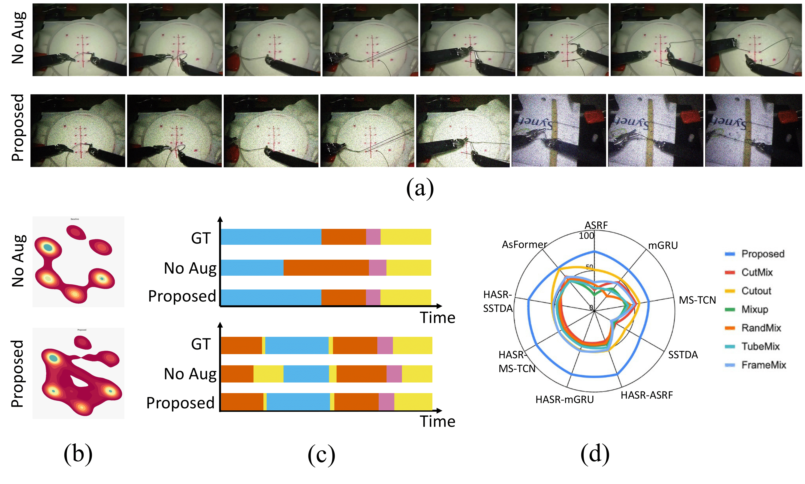

# VideoCutMix

This is the Official Implementation of the Paper: "VideoCutMix: Temporal Segmentation of Surgical Videos in Scarce Data Scenarios", accepted for publication in MICCAI 2024. 



# Data Preparation

If you want to extract your own features, please follow the instructions specified. The original dataset can be obtained from the following link.

Link: https://drive.google.com/drive/folders/1-YMllRc16iUKEVmnYLjtpiDBFDWS2efj

Download the preprocessed dataset from the same link.

# Installation

The following repository has been tested in CUDA 11.7, Python=3.7, PyTorch=1.13.1

```
conda create --name=videocutmix python=3.7.16
conda activate videocutmix
pip install torch==1.13.1+cu117 torchvision==0.14.1+cu117 torchaudio==0.13.1 --extra-index-url https://download.pytorch.org/whl/cu117
pip install PyYAML==5.4.1
```

# Getting Started

To train the model, just run the following command. 
```
bash scripts/run.sh
```
A results.json file will be created at the end of the process, which will consist of the results of the experiment.

# Citation

If you find this repository useful, please use the following BibTeX entry for citation.

@InProceedings{Dha_VideoCutMix_MICCAI2024,\
        author = { Dhanakshirur, Rohan Raju and Tyagi, Mrinal and Baby, Britty and Suri, Ashish and Kalra, Prem and Arora, Chetan},\
        title = {VideoCutMix: Temporal Segmentation of Surgical Videos in Scarce Data Scenarios},\        
        booktitle = {proceedings of Medical Image Computing and Computer Assisted Intervention -- MICCAI 2024},\
        year = {2024},\        
        publisher = {Springer Nature Switzerland},\
        volume = {LNCS 15006},\
        month = {October},\
        page = {725--735}\
}
